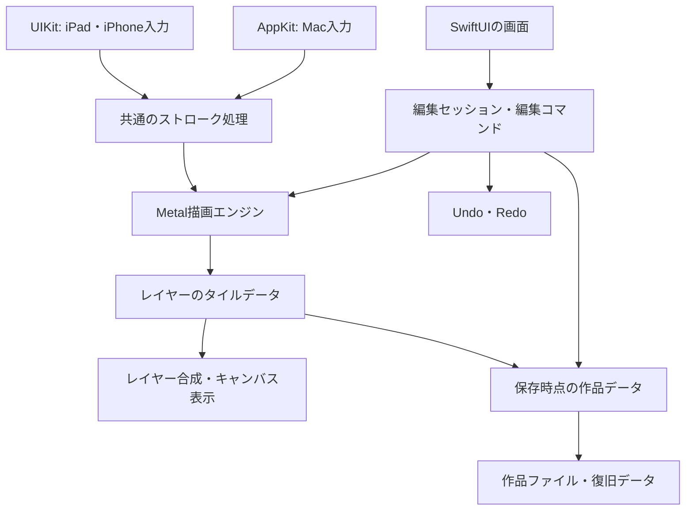

# Mac・iPad・iPhone対応お絵かきアプリ 初期設計案

作成日: 2026-10-07
状態: 設計提案。実装および実機検証は未実施。

## 1. 確認済みの要望と設計方針

確認済みの要望:

- 軽い応答と調整可能なブラシを備えた独自のお絵かきアプリ。
- 初期版からMac・iPad・iPhoneのすべてに対応する。
- 最優先は描き心地。滑らかな線、筆圧、手ぶれ補正を重視する。
- 現段階では設計を行う。

提案するコンセプトは「線を気持ちよく描ける、イラスト制作向けのラスターペイントアプリ」。製品で重視する価値は、軽い応答、調整しやすいブラシ、手ぶれ補正、ブラシとレイヤーにすぐ手が届く操作に置く。

描画エンジン、作品データ、ブラシ定義、編集履歴は共通にする。画面配置と入力処理は端末に合わせる。同じブラシ設定の意味を共通にしつつ、入力機器の違いに合わせた調整を可能にする。

現時点の仮定:

- 通常の絵はピクセルで保存する。編集可能な曲線は後続の別機能とする。
- 初期版はローカル保存と作品ファイルの受け渡しを基本とする。自動クラウド同期は後続候補。
- 色はsRGB・8bit RGBAを基本とする。広色域・16bit・HDRは後続候補。
- OSの下限、基準となる端末、製品名、販売方法は未決定。

## 2. 端末ごとの入力と画面

| 項目 | Mac | iPad | iPhone |
| --- | --- | --- | --- |
| 主な描画入力 | 対応ペンタブ、マウス | 対応するApple Pencil、指 | 指、タッチ入力として扱われるスタイラス |
| 筆圧 | 入力機器・ドライバが提供する場合 | 対応するPencilが提供する場合 | 通常のタッチ入力では実筆圧を前提にしない |
| 補助操作 | キーボード、ホイール、トラックパッド | ピンチ、2本指の操作 | ピンチ、2本指の操作 |
| パネル | 左にブラシ・色、中央にキャンバス、右にレイヤー | 片側に細いツール列、必要時に設定・レイヤーを開く | キャンバス中心、下部のツール列から設定・レイヤーを開く |

iPhoneはApple Pencilに対応していない。Apple Pencilもモデルによって筆圧対応が異なるため、端末名だけで判断せず入力の能力を確認する。筆圧がない入力では一定の太さを基本とし、速度による太さの変化や始点・終点の細まりを選択できるようにする。これらは筆圧とは別の設定として表示する。

MacのペンタブはAppKit経由の筆圧・傾き・近接イベントを扱う。対応状況は実機とドライバの組み合わせで検証する。

共通の画面:

1. 作品一覧: 新規作成、最近の作品、作品を開く。
2. 作成設定: キャンバスサイズ、背景色、プリセット。
3. 編集画面: キャンバス、ツール、色、ブラシ、レイヤー、戻す・やり直す。
4. 書き出し画面: PNG、背景の透過、保存先。

編集中はキャンバスを最大限に広く使う。サイズと不透明度は、詳細設定を開かずに変更できる。左右の利き手に合わせてツール位置を変えられるようにする。

操作案:

- 全端末で拡大・縮小・移動・回転に対応する。
- iPadはPencil描画と指によるキャンバス操作を基本とし、指描画も設定で選べる。
- iPhoneは1本指で描画、2本指でキャンバス操作を基本とする。
- 2本指のタップによるUndoは、2本指の移動操作と混同しないよう判定する。
- MacはSpaceで移動、Bでペン、Eで消しゴム、Command-ZでUndoを候補とする。
- レイヤーや設定を開いていても、現在のツール・色・レイヤーが分かる状態にする。

## 3. 技術構成

推奨構成はSwift + SwiftUI + Metal。

- **SwiftUI**: 作品一覧、パネル、設定、メニューなどの操作画面。
- **UIKit / AppKit**: iPad・iPhone / Macの入力イベント、ジェスチャー、カーソル、ネイティブのファイル操作。
- **Metal / MetalKit**: ブラシの描画、レイヤー合成、キャンバス表示。描画ビューはMTKViewをSwiftUIに組み込む。
- **Swift Package**: 共通のデータモデルと描画処理をアプリ画面から分離する。

Mac版はネイティブmacOSターゲットを推奨する。ペンタブ入力、メニュー、ショートカットをAppKitで調整しやすいため。iPad・iPhoneは1つのiOSターゲットで画面幅と入力能力に対応する。

PencilKitは標準的なペン入力をすばやく実現できる選択肢だが、今回の中心要件には独自ブラシ、手ぶれ補正、ラスターレイヤー合成の細かな制御がある。描画の中心は独自エンジンに置く提案とする。独自エンジンは実装量が増えるため、初期の実機試作で実現性を確認する。



想定モジュール:

| モジュール | 責務 |
| --- | --- |
| DrawingCore | 作品・レイヤー・ブラシ定義、座標変換、ストローク処理、編集コマンド |
| RenderingMetal | ブラシ描画、タイル更新、合成、表示、一時プレビュー |
| DocumentStore | ファイル形式、保存・読み込み、形式更新、復旧 |
| PlatformInput | UIKit・AppKitのイベントを共通入力へ変換 |
| AppUI | 端末ごとの画面、パネル、アクセシビリティ、ショートカット |

入力イベントはその場で描画に渡し、SwiftUIの画面状態更新を毎回経由させない。保存や圧縮も描画の待ち時間に入れない。UI、描画、保存の間で作品の変更順序とデータ所有者を明確にする。

## 4. 描き心地の設計

### 入力データ

各サンプルには、作品上の座標、時刻、入力種別、利用可能な筆圧・傾きなどを持たせる。筆圧などの有無は明示し、存在しない値を実測として扱わない。

画面上の座標はキャンバスの拡大率・回転・移動の逆変換で作品座標に直す。ブラシサイズは作品のピクセル単位で指定し、表示倍率を変えても作品上の太さが変わらないようにする。

### ストローク処理

```text
入力サンプル
→ 作品座標に変換
→ 手ぶれ補正
→ 筆圧カーブと太さ・不透明度を計算
→ 線に沿って一定間隔でブラシの形を配置
→ 変更されたタイルを更新
→ 合成して表示
```

ブラシの形を連続して配置する方式を最初の実装候補とする。配置間隔はブラシサイズに合わせる。入力イベントの数に依存して濃さや線の途切れが変わらないように、線の距離を基準に補間する。

基本ブラシ:

- ペン: 輪郭がはっきりした線。筆圧で太さを変える。
- 鉛筆: 少し柔らかい線。筆圧で太さ・不透明度を調整する。
- 消しゴム: 同じストローク処理を使い、レイヤーの透明度を減らす。

共通設定はサイズ、不透明度、硬さ、配置間隔、筆圧カーブ、手ぶれ補正とする。初期画面にはサイズ・不透明度・補正だけを出し、細かい項目は詳細設定に置く。

### 手ぶれ補正

- 補正なし: 入力の応答を優先する。
- 軽い補正: 時間間隔を考慮した平滑化で細かい震えを減らす。
- 強い補正: 線を安定させるために少し遅れて追従する。

補正の強さと遅れのバランスを、同じ試作画面で比較できるようにする。具体的なフィルターと設定値は実機で決める。角を描いたときに丸くなりすぎないこと、ペンを離したときに線の終点が自然に収まることを検証する。

### 入力予測

iPad・iPhoneでは、取得できるまとまった入力サンプルと予測サンプルを活用する。予測した線は一時表示に置き、実際の入力で置き換える。予測値は保存・Undoの確定データに混ぜない。重複サンプルや後から補正された入力値も整理し、二重描画を防ぐ。

### 筆圧設定

アプリ全体の入力機器向け筆圧調整と、ブラシごとの筆圧反応を分ける。軽い筆圧でも描きやすくする調整と、ブラシの表現上の調整を独立させる。圧力と太さの対応を見ながら調整できる試し描き欄を用意する。

## 5. レイヤーとメモリ

作品は順序を持つラスターレイヤーで構成する。各レイヤーはID、名前、表示、ロック、不透明度、合成モード、透明度保護、下のレイヤーへのクリッピングを持つ。レイヤーのグループ化は後続候補。

大きなキャンバスは小さなタイルに分割して保存・編集する。タイルサイズは256または512ピクセルを候補に実測で選ぶ。何も描かれていない領域は、透明な状態として表現し、画像データの確保を避ける。

4096×4096のRGBA8画像は1枚で64 MiB、20枚では画像データだけで1.25 GiBになる。合成用の画像、一時処理、Undoも追加される。そのため、レイヤー数だけで上限を決めず、キャンバスサイズと端末ごとのメモリ予算を組み合わせる。

タイル化しても全面に描かれた作品のデータ量は減らない。メモリ上に置くタイルを制限する仕組み、圧縮・ディスクへの退避、履歴の予算管理を組み合わせる。予算を超える編集は事前に検出し、作品を保持したまま実行可能な選択肢を示す。

初期色仕様はsRGB・8bit RGBA。ブラシの重なり方、合成時の色空間、アルファの表現、書き出しへの変換は一貫した規則にする。実際の描き味に関わるため、合成モードごとのサンプル画像で選定・検証する。

## 6. Undo・Redo

- 一筆を1操作として扱う。
- 描画は変更されたタイルの編集前・編集後の差分を保持する。
- レイヤー追加・削除・並べ替え・設定変更、塗りつぶし、変形もUndoできる。
- Undo後に新しく編集するとRedoの枝を破棄する。
- 履歴にメモリ予算を設け、必要なら圧縮とディスク退避を行う。
- 表示倍率やパネルの開閉は絵の編集履歴に混ぜない。

ブラシの設定変更やエンジン更新後でもUndoの結果を保つため、通常の復元は画像差分を基準にする。入力点だけから過去の絵を再描画する方式を、作品復元の唯一の手段にはしない。

## 7. 保存と作品の受け渡し

Mac・iPad・iPhoneで同じ作品ファイルを開ける形式を用意する。拡張子は製品名決定後に確定する。

作品ファイルに含める情報:

- 形式のバージョン、作品ID、キャンバス寸法、色仕様。
- レイヤーのID・順序・属性。
- 描画されたタイルの画像データと整合性確認用の情報。
- 作品のプレビュー。
- 必要に応じて作品で使ったブラシ定義のコピーと定義バージョン。

作品の確定画像を保存する。ブラシが変わっても既存の絵が変化しない構造にする。

保存方法:

- 描画完了などの確定した区切りで編集の世代番号を進める。
- 保存用の一貫した世代を取り、編集の継続と競合しない形で非同期に保存する。
- 頻繁な編集では更新内容を復旧用に記録し、間隔を空けて作品ファイルへまとめる。
- 保存失敗は表示し、メモリ内の作品と直前の正常な保存を保持する。
- バックグラウンドに入る直前だけに頼らず、編集中も復旧データを更新する。
- 書き出し中や保存中も、描画の応答を維持する。

最初はローカル保存、Macのファイル選択、iOSの「ファイル」連携、AirDropなどによる手動の受け渡しを想定する。ファイルを渡せることと自動同期は別の機能である。

iCloud等で自動同期を追加する場合は、複数端末の同時編集と競合を先に設計する。絵の編集を自動統合できない場合は両方の版を残す。初期版の同期要件は未確定。

## 8. 最初の製品版の機能範囲

| 分野 | 初期版の提案 |
| --- | --- |
| 描画 | ペン、鉛筆、消しゴム、筆圧調整、手ぶれ補正 |
| キャンバス | 拡大・縮小・移動・回転、左右反転表示 |
| 色 | カラーピッカー、スポイト、最近使った色 |
| レイヤー | 追加・削除・複製・並べ替え・表示切替・ロック・不透明度 |
| 合成 | 通常、乗算、スクリーン、透明度保護、クリッピング |
| 制作補助 | 矩形・投げ縄選択、移動・拡大縮小・回転、塗りつぶし |
| 編集履歴 | Undo・Redo |
| 作品管理 | 独自形式で保存・再編集、自動復旧、画像の読み込み、PNG書き出し |

選択と変形は描き心地の試作を確認した後に追加する。最初は選択した画素の変形を確定する方式とし、変形前に戻せるようにする。

塗りつぶしは参照するレイヤー、境界の許容差、塗る範囲を定義する。全レイヤー参照や線の隙間を閉じる高度な処理は段階的に追加する。

後続候補:

- 水彩、混色、にじみ、テクスチャブラシ。
- レイヤーグループ、レイヤーマスク。
- 編集可能な線画・曲線レイヤー。
- PSDの読み込み・書き出し。対応するレイヤー属性と合成の範囲を別途調査する。
- 他の作品形式との互換。公開仕様とライセンスを調査してから判断する。
- 自動クラウド同期、制作過程の記録。

## 9. 性能目標と確認方法

以下は試作で検証する目標であり、現段階の性能保証ではない。数値は基準となる端末とOSを選んでから確定する。

- まず2048×2048、表示中のラスターレイヤー10枚を基準作品候補とする。
- 基準端末で描画中の60fpsを目標とする。対応する120Hz端末は120fpsを追加目標とする。
- 保存・Undo・パネル操作が、描画の長い停止を引き起こさないこと。
- 4096×4096以上は別に負荷試験を行い、レイヤーと履歴の上限を判断する。
- 見た目の線の遅れ、フレーム時間のばらつき、メモリ使用量を測る。

描き心地の確認:

- ゆっくりした斜線、すばやい長い線、円、細かいハッチング、鋭い角、抜きのある線。
- 同じ動作を表示倍率25%・100%・400%で行う。
- 軽い筆圧から強い筆圧までの太さの変化を確認する。
- 補正なし・軽い補正・強い補正を同じ設定画面で比較する。
- iPhoneの指描画でも、意図せず線が細くなる・途切れることがないか確認する。
- iPadの指とPencilの切り替え、Macのペンタブとマウスの切り替えを確認する。

正しさと復旧の確認:

- 連続描画、Undo・Redo、削除したレイヤーの復元。
- 保存・読み込みで画素とレイヤー属性が保たれること。
- Macで保存した作品をiPad・iPhoneで開き、再編集して戻せること。
- PNGの透明度・色と、画面表示との対応。
- 保存中断、容量不足、バックグラウンド移行後の復旧。
- 予測線が確定画像や保存に残らないこと。

描き味は数字だけで決まらない。普段の線の描き方を、実際にこの試作で試して設定を詰める。

## 10. 実装の順序と判断の区切り

### 第1段階: 共通エンジンの試作

3端末のアプリに共通エンジンを組み込み、1つのブラシ、消しゴム、拡大・移動、筆圧、手ぶれ補正、1筆単位のUndo、簡単な保存・読み込みを実装する。

目的はMacのペンタブ、iPadのPencil、iPhoneの指で描き心地を比べること。最初は小さな作品を対象にし、製品版の画面装飾より応答と入力処理を先に評価する。

通過条件: 入力に大きな欠落がなく、補正を調整すると狙った線を描ける。1筆Undoが正しく動き、保存した絵を再度開ける。

### 第2段階: 日常的に描ける基盤

タイルによる作品データ、レイヤー合成、履歴予算、作品形式、自動復旧、画像読み込み・PNG書き出しを整える。3端末で同じ作品を受け渡せることを確認する。

通過条件: 基準作品で性能目標を確認し、絵を保持したまま負荷と保存失敗に対応できる。

### 第3段階: 初期製品版の制作機能

鉛筆、色選択、選択・変形、塗りつぶし、透明度保護、クリッピング、端末ごとのパネルとショートカットを整える。

通過条件: 作品作成から書き出しまで、Mac・iPad・iPhoneのそれぞれで一通り完了できる。

### 第4段階: ブラシ表現を広げる

ブラシの描き味を調整したうえで、水彩・混色・質感を別の試作として検証する。PSD互換や同期は、必要性と実装範囲を決めて追加する。

## 11. 次に決める項目

1. 基準となるMac・ペンタブ、iPad・Pencil、iPhoneとOS下限。
2. 希望する筆圧・線の入り抜き・補正の感触。
3. 日常的に使いたいキャンバスサイズとレイヤー数。
4. 最初から自動同期が必要か、ファイルの受け渡しで始められるか。

この設計から着手する次の成果物は、3端末で動く描き心地の試作。その実機結果をもとに、ブラシ処理と性能予算を確定する。
